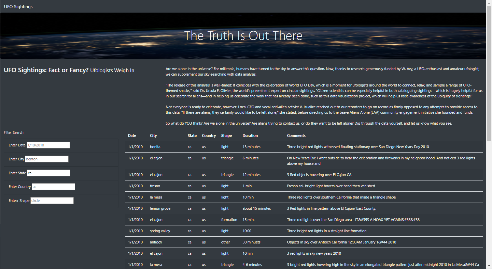
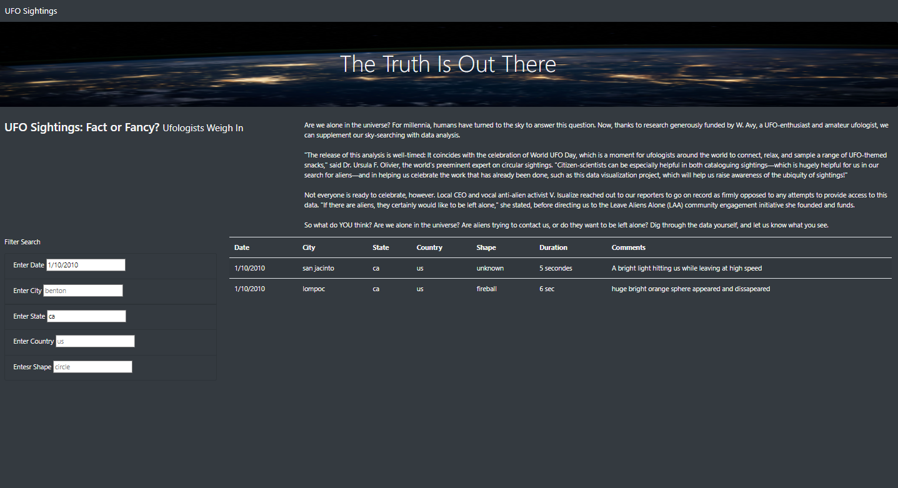

# UFOs JavaScript Table Webpage

## Overview of the Webpage

### Purpose
Our purpose for this project was to assist Dana, a data journalist, who is writing about an aspect of her home town and specifically the UFO phenomenon its widely known for. Using a JavaScript file filled with UFO sighting information like the country, city, state and type for each different occurrence. For this project we used JavaScript to display this information as a table. With the amount of data available we created filters to make the table fully dynamic so that it will react to user input. Dana will be posting her article online so we incorporated the table along with other elements into an HTML file to build a webpage for easy viewing. 

## UFOs Results

### Table Search Criteria
The webpage's search criteria offers five different filter options to drill down and select entries based off of the information that the user inputs. The five available filters that users can choose from are the Date, City, State, Country, and Shape of the specific events they would like to pull information on. Multiple search criteria can be entered into the filters at once if the user knows exactly the event that they're looking for. Alternatively, one field can be entered such as a state to see all of the events that occurred with this selection first, for example in the first screenshot below California is entered for the state. Then the user can enter a second filter such as a date, for example 1/10/2010, to pull in all events that contain occurred on this date within California as shown in the second screenshot below. To then clear the filters, the user will select the link in the top left-hand corner of the webpage "UFO Sightings" which brings them back to the home page and clears the previously entered filters. 

## UFOs Webpage Summary

### UFOs Webpage Further Enhancements 
One drawback of the current design of the webpage is that it isn't specifically clear to the user what the range is for possible search criteria when filtering through the entries stored in the table. It does clearly display the formatting that the filter system will accept, but some users may be unsure exactly on the extent of information which they can enter that will return a result. A further enhancement to the webpage that can help alleviate this drawback would be to include a key section for the filter options. Some such as the state and city most likely wouldn't need this feature, but a date range, along with available shapes and countries can be included. Another further development to the webpage can be a clear filters button that is specifically labeled to complete this task, instead of the UFO Sightings link in the top left hand corner of the page which brings the user back to the home table screen. 

